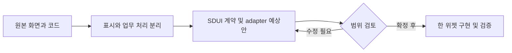

# planning-harness — SDUI 위젯 후보

목표: 원래 화면의 역할과 코드를 확인하고, 한 위젯씩 분리할 대상을 정한다. 기준: `main` / `2e3fba09de335094b7c42e3912bae863e1c1c03f`.

Worker/D1 기반 기획·기록 도구이며 주소 선택 SDUI 초안을 보유한다. 실제 기록·칸반 API와 문서/계약 단계 주소 블록을 구분해야 한다.

공개 범위: 비공개. 비공개/명시 라이선스 없음: 코드·업무 자료 외부 납품 범위 확인; 공개 호스트에는 원문 복사 금지. 후보는 구현 완료나 재배포 허가를 의미하지 않는다.

9/18·19·20 KST 커밋 수: 0 / 2 / 0. 병합·문서 커밋 포함; 기능 수 아님. 일요일은 조사 시점까지만.

|ID|위젯 후보|현재 상태|분리 작업|
|---|---|---|---|
|R04-W01|주소 찾기·상세주소 입력|draft 메타데이터·카탈로그 구현; 실제 어댑터 런타임 미확인|KMovement OPEN_POSTCODE와 값 계약 대조; 웹/모바일 어댑터 각각 구현·검증|
|R04-W02|한 번 눌러 생활 기록|화면·서버 구현; SDUI 독립 추출 전|UI 모달과 DB adapter 분리, 고객에 불필요한 사진·위치 제외|
|R04-W03|작업 칸반 목록·상태 변경|API 구현; 독립 SDUI 칸반 화면 추출 제안|공통 상태보드 UI로 분리하되 회의/GitHub business adapter는 별도|

## R04-W01 · 주소 찾기·상세주소 입력

주소 선택 결과를 공통 값으로 정규화하는 블록 초안이다.

|항목|내용|
|---|---|
|입력|zipCode,roadAddress,detailAddress; provider/previewMode|
|처리|manifest와 메타데이터에 mock/web-daum/mobile-native 어댑터 및 이벤트 선언|
|반환·화면|ADDRESS_SELECTED 등 이벤트·onChange 계약 제안|
|API|실제 검색 API 연결 미확인|
|저장|업무 DB 없음; formData 계약|
|부수효과|초안 자체는 외부 호출·저장 없음|
|보안·분리 경계|상세주소는 개인정보; 검색 제공자 스크립트·origin 허용을 좁힐 것|
|공통화 계열|주소 입력|
|구현 후 통과 기준|mock은 외부 호출 0; 선택 취소·실패·상세주소 보존 및 actual host 호환|

핵심 코드:
- ["status": "draft" · app/public/examples/address-select-block/metadata/address-select-block.screen.json:5](https://github.com/feed-mina/planning-harness/blob/2e3fba09de335094b7c42e3912bae863e1c1c03f/app/public/examples/address-select-block/metadata/address-select-block.screen.json#L5)
- [address-select-block · app/public/src/template-catalog.js:5](https://github.com/feed-mina/planning-harness/blob/2e3fba09de335094b7c42e3912bae863e1c1c03f/app/public/src/template-catalog.js#L5)

## R04-W02 · 한 번 눌러 생활 기록

버튼/항목/메모를 사용자별 날짜 기록으로 저장한다.

|항목|내용|
|---|---|
|입력|id,buttonId 또는 buttonLabel,itemLabel,note,loggedAt 등|
|처리|모달 → createQuickLogEntry: 기존 id 소유권·중복 확인, 사용자 시간대 날짜 계산, 버튼 모드 검증|
|반환·화면|log,idempotent 및 삭제 상태|
|API|POST /api/quick-log/logs; GET /api/quick-log/overview|
|저장|D1 user_quick_logs,user_quick_buttons,user_quick_button_items|
|부수효과|DB쓰기; 중복 POST는 원기록 반환, 삭제 복구는 명시 endpoint|
|보안·분리 경계|사용자 인증·user_id 격리 유지; 사진/위치/메모는 민감 필드|
|공통화 계열|활동 기록|
|구현 후 통과 기준|동일 id 재전송, 타인 id, 날짜 경계, 삭제 후 늦은 재전송|

핵심 코드:
- [// Quick Log · app/public/assets/quick-log.js:1](https://github.com/feed-mina/planning-harness/blob/2e3fba09de335094b7c42e3912bae863e1c1c03f/app/public/assets/quick-log.js#L1)
- [export async function createQuickLogEntry · app/src/domains/planning/quickLog/quickLog.ts:498](https://github.com/feed-mina/planning-harness/blob/2e3fba09de335094b7c42e3912bae863e1c1c03f/app/src/domains/planning/quickLog/quickLog.ts#L498)
- [path === "/api/quick-log/logs" · app/src/router.ts:919](https://github.com/feed-mina/planning-harness/blob/2e3fba09de335094b7c42e3912bae863e1c1c03f/app/src/router.ts#L919)

## R04-W03 · 작업 칸반 목록·상태 변경

사용자 보드의 작업을 모아 상태·우선순위를 바꾼다.

|항목|내용|
|---|---|
|입력|userId,boardId,status,cardId와 수정 body|
|처리|listKanbanCards는 사용자·보드 조건 조회; updateKanbanCard는 소유권 조회 뒤 업데이트|
|반환·화면|cards 배열/갱신 카드|
|API|GET /api/kanban/cards; PATCH /api/kanban/cards/:id|
|저장|D1 kanban_cards,kanban_boards|
|부수효과|작업 및 보드 updated_at 변경|
|보안·분리 경계|회의 source_raw와 GitHub 링크가 포함될 수 있음; 테넌트 격리와 출력필드 최소화|
|공통화 계열|상태보드|
|구현 후 통과 기준|다른 사용자 보드 차단, 상태 허용값, 300개 목록 상한, 동시 수정|

핵심 코드:
- [export async function listKanbanCards · app/src/domains/planning/kanban.ts:243](https://github.com/feed-mina/planning-harness/blob/2e3fba09de335094b7c42e3912bae863e1c1c03f/app/src/domains/planning/kanban.ts#L243)
- [export async function updateKanbanCard · app/src/domains/planning/kanban.ts:335](https://github.com/feed-mina/planning-harness/blob/2e3fba09de335094b7c42e3912bae863e1c1c03f/app/src/domains/planning/kanban.ts#L335)
- [path === "/api/kanban/cards" · app/src/router.ts:1383](https://github.com/feed-mina/planning-harness/blob/2e3fba09de335094b7c42e3912bae863e1c1c03f/app/src/router.ts#L1383)

## 예상 작업 순서

이번 조사: 정적 소스 확인. 앱 실행·운영 API·실제 고객 화면 동등성은 검증하지 않았다. 위 흐름은 향후 작업 계획이며 현재 앱 호출 흐름이 아니다.

---

## 화면에서 코드를 따라 읽기

화면 동작 → 처리 코드 → 요청·저장 → 반환과 부수효과 → 수정·검증 순서로 읽는다. UI가 없는 후보는 표시 화면을 새로 만드는 제안이다. 이 문서는 기존 조사 SHA를 기준으로 재구성했으며 최신 앱 실행 검증이 아니다.

### R04-W01 · 주소 찾기·상세주소 입력

주소 선택 결과를 공통 값으로 정규화하는 블록 초안이다.

**현재 상태:** draft 메타데이터·카탈로그 구현; 실제 어댑터 런타임 미확인

|화면·코드 연결|확인 내용|
|---|---|
|화면에 나오는 결과|ADDRESS_SELECTED 등 이벤트·onChange 계약 제안|
|화면이 받는 값|zipCode,roadAddress,detailAddress; provider/previewMode|
|담당 로직|manifest와 메타데이터에 mock/web-daum/mobile-native 어댑터 및 이벤트 선언|
|요청 창구|실제 검색 API 연결 미확인|
|저장소 경계|업무 DB 없음; formData 계약|
|반환과 별도인 동작|초안 자체는 외부 호출·저장 없음|

**핵심 파일의 확인 지점**

- ["status": "draft"](https://github.com/feed-mina/planning-harness/blob/2e3fba09de335094b7c42e3912bae863e1c1c03f/app/public/examples/address-select-block/metadata/address-select-block.screen.json#L5) — `app/public/examples/address-select-block/metadata/address-select-block.screen.json`에서 이 기능의 선언·호출·계약을 확인한다. 코드 링크는 원래 조사 SHA에 고정되어 있다.
- [address-select-block](https://github.com/feed-mina/planning-harness/blob/2e3fba09de335094b7c42e3912bae863e1c1c03f/app/public/src/template-catalog.js#L5) — `app/public/src/template-catalog.js`에서 이 기능의 선언·호출·계약을 확인한다. 코드 링크는 원래 조사 SHA에 고정되어 있다.

**유지보수 시 변경할 범위:** KMovement OPEN_POSTCODE와 값 계약 대조; 웹/모바일 어댑터 각각 구현·검증
**보안·공통화 경계:** 상세주소는 개인정보; 검색 제공자 스크립트·origin 허용을 좁힐 것
**회귀 확인:** mock은 외부 호출 0; 선택 취소·실패·상세주소 보존 및 actual host 호환

### R04-W02 · 한 번 눌러 생활 기록

버튼/항목/메모를 사용자별 날짜 기록으로 저장한다.

**현재 상태:** 화면·서버 구현; SDUI 독립 추출 전

|화면·코드 연결|확인 내용|
|---|---|
|화면에 나오는 결과|log,idempotent 및 삭제 상태|
|화면이 받는 값|id,buttonId 또는 buttonLabel,itemLabel,note,loggedAt 등|
|담당 로직|모달 → createQuickLogEntry: 기존 id 소유권·중복 확인, 사용자 시간대 날짜 계산, 버튼 모드 검증|
|요청 창구|POST /api/quick-log/logs; GET /api/quick-log/overview|
|저장소 경계|D1 user_quick_logs,user_quick_buttons,user_quick_button_items|
|반환과 별도인 동작|DB쓰기; 중복 POST는 원기록 반환, 삭제 복구는 명시 endpoint|

**핵심 파일의 확인 지점**

- [// Quick Log](https://github.com/feed-mina/planning-harness/blob/2e3fba09de335094b7c42e3912bae863e1c1c03f/app/public/assets/quick-log.js#L1) — `app/public/assets/quick-log.js`에서 이 기능의 선언·호출·계약을 확인한다. 코드 링크는 원래 조사 SHA에 고정되어 있다.
- [export async function createQuickLogEntry](https://github.com/feed-mina/planning-harness/blob/2e3fba09de335094b7c42e3912bae863e1c1c03f/app/src/domains/planning/quickLog/quickLog.ts#L498) — `app/src/domains/planning/quickLog/quickLog.ts`에서 이 기능의 선언·호출·계약을 확인한다. 코드 링크는 원래 조사 SHA에 고정되어 있다.
- [path === "/api/quick-log/logs"](https://github.com/feed-mina/planning-harness/blob/2e3fba09de335094b7c42e3912bae863e1c1c03f/app/src/router.ts#L919) — `app/src/router.ts`에서 이 기능의 선언·호출·계약을 확인한다. 코드 링크는 원래 조사 SHA에 고정되어 있다.

**유지보수 시 변경할 범위:** UI 모달과 DB adapter 분리, 고객에 불필요한 사진·위치 제외
**보안·공통화 경계:** 사용자 인증·user_id 격리 유지; 사진/위치/메모는 민감 필드
**회귀 확인:** 동일 id 재전송, 타인 id, 날짜 경계, 삭제 후 늦은 재전송

### R04-W03 · 작업 칸반 목록·상태 변경

사용자 보드의 작업을 모아 상태·우선순위를 바꾼다.

**현재 상태:** API 구현; 독립 SDUI 칸반 화면 추출 제안

|화면·코드 연결|확인 내용|
|---|---|
|화면에 나오는 결과|cards 배열/갱신 카드|
|화면이 받는 값|userId,boardId,status,cardId와 수정 body|
|담당 로직|listKanbanCards는 사용자·보드 조건 조회; updateKanbanCard는 소유권 조회 뒤 업데이트|
|요청 창구|GET /api/kanban/cards; PATCH /api/kanban/cards/:id|
|저장소 경계|D1 kanban_cards,kanban_boards|
|반환과 별도인 동작|작업 및 보드 updated_at 변경|

**핵심 파일의 확인 지점**

- [export async function listKanbanCards](https://github.com/feed-mina/planning-harness/blob/2e3fba09de335094b7c42e3912bae863e1c1c03f/app/src/domains/planning/kanban.ts#L243) — `app/src/domains/planning/kanban.ts`에서 이 기능의 선언·호출·계약을 확인한다. 코드 링크는 원래 조사 SHA에 고정되어 있다.
- [export async function updateKanbanCard](https://github.com/feed-mina/planning-harness/blob/2e3fba09de335094b7c42e3912bae863e1c1c03f/app/src/domains/planning/kanban.ts#L335) — `app/src/domains/planning/kanban.ts`에서 이 기능의 선언·호출·계약을 확인한다. 코드 링크는 원래 조사 SHA에 고정되어 있다.
- [path === "/api/kanban/cards"](https://github.com/feed-mina/planning-harness/blob/2e3fba09de335094b7c42e3912bae863e1c1c03f/app/src/router.ts#L1383) — `app/src/router.ts`에서 이 기능의 선언·호출·계약을 확인한다. 코드 링크는 원래 조사 SHA에 고정되어 있다.

**유지보수 시 변경할 범위:** 공통 상태보드 UI로 분리하되 회의/GitHub business adapter는 별도
**보안·공통화 경계:** 회의 source_raw와 GitHub 링크가 포함될 수 있음; 테넌트 격리와 출력필드 최소화
**회귀 확인:** 다른 사용자 보드 차단, 상태 허용값, 300개 목록 상한, 동시 수정
