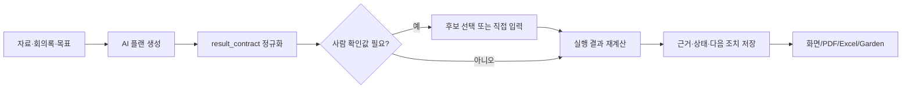

# 분석 결과 계약과 사람 입력 확정 게이트

## 1. 목적

분석설계 결과를 근거 기반의 실행 결과로 유지한다. 숫자를 만들 수 없는 경우에는 임의의 정밀한 값을 출력하지 않고, 필요한 근거·입력값·다음 조치를 구조적으로 표시한다.

## 2. 처리 흐름

## 3. 결과 종류

| kind | 용도 | 필수 표시 |
|---|---|---|
| `calculation` | 수문 조사비, 원가, 단가 | 수식·변수·단위·결과값·근거 |
| `comparison` | 예산/정책/지역 비교 | 비교표·차이·해석·근거 |
| `report` | 정책·산업·회의 보고서 | 범위·요약·근거·결론/다음 조치 |
| `procedure` | 브라우저 계정 전환 등 | 사용자 수행 체크리스트·주의사항 |
| `summary_decision` | 의사결정 요약 | 답변·가정·확인 항목 |

공통 contract에는 `kind`, `title`, `status`, `answer`, `result_value`, `evidence_refs`, `missing_inputs`, `human_input_fields`, `assumptions`, `next_actions`가 포함된다.

## 4. 사람 입력 확정

결과에 영향을 크게 주는 숫자·단위·기준값만 게이트로 표시한다.

- 후보값이 있으면 후보 선택과 직접 입력을 모두 제공한다.
- 직접 입력값에는 값·단위·메모를 남긴다.
- 확정값은 AI 후보값보다 우선하고 수식·표·리포트에 동일하게 반영한다.
- 사용자가 실제로 수행하지 않은 외부 시스템 작업은 `needs_user_action`으로 유지한다.

## 5. 구조화 실패 fallback

AI 응답이 JSON이 아니거나 `result_contract`를 빠뜨려도 플랜을 버리지 않는다. `app/src/analysis.ts`가 제목과 상세를 기준으로 결과 종류를 추정해 안전한 contract를 만든다.

- 결과값은 `null`로 둔다.
- 상태는 `needs_evidence`로 둔다.
- 계산형은 `입력값 확인 후 적용 수식 확정` 상태의 빈 변수를 사용한다.
- 보고서형은 분석 범위와 확인 필요 사항만 작성한다.
- 절차형은 사용자 확인 체크리스트를 작성한다.
- 모든 fallback에는 원본 근거 확인, 필수 입력값 확정, 결과 재실행이 다음 조치로 남는다.

따라서 구조화 실패가 곧 가짜 숫자나 완료 주장으로 이어지지 않는다.

## 6. 저장·표시 경로

1. AI 플랜: `analysis_outputs(kind='plans')`
2. 실행 결과: `analysis_outputs(kind='plan_runs' 또는 'executions')`
3. 화면: `analysis-edit2`의 결과 계약 카드
4. 마이페이지: 실행 결과와 사람 확정값 요약
5. Garden: 선택된 분석 결과를 content package의 문서/섹션으로 변환

모든 경로는 동일한 결과 계약을 사용해야 하며, 근거가 없는 값은 확정 결과로 표시하지 않는다.

## 7. 검증 기준

- 타입 검사: `cd app; npm run typecheck`
- 수치 보존: 숫자·불리언 `result_value`가 문자열 변환으로 손실되지 않음
- 구조 보존: checklist/table/report 섹션의 객체가 제거되지 않음
- 사람 우선: 수동 입력값이 seeded AI 변수보다 우선
- 안전 fallback: contract 누락 플랜도 `needs_evidence`와 `missing_inputs`를 가짐
- 사용자 세션 검증: 로그인 후 실제 자료로 플랜 생성 → 입력 확정 → 실행 → 캡처

마지막 항목은 OAuth 또는 이메일 로그인 세션이 연결된 뒤 운영 화면에서 확인한다.
