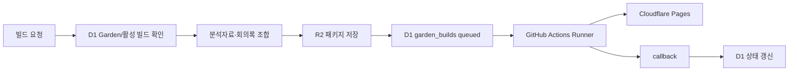

# Garden 빌드·배포 인메모리 캐시 설계

> 구현 상태(2026-07-11): `garden-content-v2.1` 기준 fingerprint, 60초 in-flight 합치기, D1 성공 빌드 재사용, 강제 재빌드, 사용자별 10초 Garden/3초 빌드 조회 캐시가 구현되었다. 관련 스키마는 `0063_garden_build_fingerprint.sql`에 있다.

> 상태: 설계·운영 문서
> 범위: Garden 설정 저장, 빌드 패키지 생성, Runner 실행, Cloudflare Pages 배포  
> 관련 구조 문서: [`architecture-sdui-db-api.md`](./architecture-sdui-db-api.md)

## 1. 목적

같은 Garden 설정과 같은 분석자료로 빌드를 반복 요청할 때 다음 문제를 줄인다.

- 같은 콘텐츠 패키지를 여러 번 계산하는 문제
- 연속 클릭으로 `queued` 빌드가 중복 생성되는 문제
- 동일 결과를 Runner와 Cloudflare Pages에 중복 배포하는 문제
- 빌드 목록을 새로고침할 때마다 D1을 반복 조회하는 문제

인메모리 캐시는 **성능 최적화와 동시 요청 합치기**에만 사용한다. 빌드 상태와 산출물의 원본은 계속 D1과 R2에 둔다.

## 2. 현재 Garden 빌드 흐름

현재 `app/src/gardens.ts`의 `createGardenBuild()`는 다음 순서로 동작한다.

1. 사용자 소유 Garden을 확인한다.
2. 일일 빌드 제한과 해당 Garden의 `queued/running` 빌드를 확인한다.
3. 분석자료·회의록·직접 작성 내용을 조합해 콘텐츠 패키지를 만든다.
4. `garden.config.yaml`, `manifest.json`, `content-package.json`을 R2에 저장한다.
5. `garden_builds`에 `queued` 빌드를 등록한다.
6. Runner가 패키지를 가져가 빌드·배포한다.
7. Runner callback으로 `running`, `succeeded`, `failed` 상태를 갱신한다.



## 3. 캐시 계층

### 3.1 Worker 인메모리 캐시

동일 isolate 안에서 같은 입력의 동시 계산을 합친다.

```ts
const gardenBuildInflight = new Map<
  string,
  Promise<PreparedGardenBuild>
>();
```

키는 최소한 다음 범위를 포함한다.

```text
user_id:garden_id:build_fingerprint
```

권장 TTL은 30~60초다. 이 캐시는 연속 클릭, 여러 화면의 동시 요청, 진행 중인 콘텐츠 패키지 계산의 중복을 줄이는 용도로만 사용한다.

Worker 재시작, 새 isolate, 다른 데이터센터에서는 값이 사라질 수 있다. 따라서 이 값이 없더라도 D1과 R2만으로 정상 동작해야 한다.

### 3.2 D1 fingerprint 및 빌드 이력

동일한 입력을 여러 isolate에서 요청해도 중복 배포를 막으려면 영속적인 fingerprint가 필요하다.

```text
build_fingerprint = SHA-256(
  builder_version
  + canonical garden.config.yaml
  + 분석자료 ID·수정시각
  + 회의록 ID·수정시각
  + 로고 버전
  + deploy_target
  + issuesDir
  + publish.label
)
```

현재 `package_sha256`는 콘텐츠 패키지 무결성 확인에 사용하고, 설정까지 포함한 중복 판단에는 별도의 `build_fingerprint`를 추가하는 것을 권장한다.

예상 migration:

```sql
ALTER TABLE garden_builds ADD COLUMN build_fingerprint TEXT;
ALTER TABLE garden_builds ADD COLUMN builder_version TEXT;

CREATE INDEX idx_garden_builds_fingerprint
  ON garden_builds(garden_id, build_fingerprint, status);
```

### 3.3 R2 빌드 패키지

현재처럼 build ID별 패키지를 R2에 저장한다. 이후 패키지 재사용이 필요해지면 fingerprint 기반의 별도 캐시 경로를 추가할 수 있다.

```text
gardens/{user}/{garden}/builds/{build_id}/garden.config.yaml
gardens/{user}/{garden}/builds/{build_id}/manifest.json
gardens/{user}/{garden}/builds/{build_id}/content-package.json
```

1차 구현에서는 R2 복사 구조를 복잡하게 만들기보다, 동일 fingerprint의 성공 빌드를 재사용해 Runner 자체를 생략하는 방식을 우선한다.

## 4. 중복 빌드 판단 규칙

| 조건 | 동작 |
|---|---|
| 같은 fingerprint의 `queued/running` 존재 | 기존 빌드 응답 반환 |
| 같은 fingerprint의 `succeeded` 존재 + 사이트 유효 | 새 Runner를 실행하지 않고 기존 사이트 반환 |
| 설정·자료·로고·배포 대상 변경 | fingerprint 변경 후 새 빌드 생성 |
| 같은 fingerprint의 `failed` 존재 | 새 시도 허용 |
| 사용자가 캐시 무시 재빌드 선택 | 새 build ID로 강제 실행 |

캐시 적중만으로 `succeeded`로 표시하지 않는다. 실제 성공 확정은 Runner callback 이후에만 한다.

## 5. 조회 응답 캐시

Garden 목록과 최근 빌드 목록은 짧은 TTL로만 캐시할 수 있다.

| 조회 | TTL 예시 | 무효화 |
|---|---:|---|
| Garden 목록 | 5~15초 | Garden 저장·삭제 |
| Garden 상세 | 5~15초 | 설정·로고 변경 |
| 최근 빌드 목록 | 2~5초 | 빌드 생성·callback·삭제 |
| `queued/running` 상태 | 가능하면 캐시하지 않음 | 즉시 D1 재조회 |

모든 키는 `user_id`와 `garden_id`를 포함해야 한다. 비공개 Garden 응답을 사용자 간 공유 캐시에 저장하면 안 된다.

## 6. 무효화 규칙

다음 이벤트에서 관련 인메모리 캐시를 삭제한다.

- Garden 설정 저장
- 분석자료·회의록 추가, 삭제, 수정
- 로고 편집·삭제
- 공개 기준 label 변경
- Issues 경로 변경
- 배포 대상 변경
- Runner callback 수신
- 빌드 삭제
- Garden 삭제

Fingerprint는 입력이 바뀌면 자연스럽게 달라져야 하며, 무효화는 화면에 오래된 상태가 남지 않도록 보조적으로 수행한다.

## 7. 보안 원칙

캐시에는 다음 값을 저장하지 않는다.

- JWT와 로그인 세션
- `GARDEN_RUNNER_TOKEN` 또는 기타 비밀 값
- 권한 판정 결과
- 사용자별 비공개 YAML 원문을 공개 CDN 캐시에 저장하는 방식

인증된 API의 캐시 키는 항상 사용자와 Garden 범위로 제한한다. D1은 권한과 상태의 원본, R2는 빌드 산출물의 원본으로 유지한다.

Cloudflare Cache API는 Worker의 데이터센터 단위 임시 캐시이고, KV는 최종적 일관성을 사용하므로 인증 상태나 빌드 성공 여부의 단일 원본으로 사용하지 않는다.

- [Cloudflare Cache API](https://developers.cloudflare.com/workers/runtime-apis/cache/)
- [Workers 캐시 동작 방식](https://developers.cloudflare.com/workers/reference/how-the-cache-works/)
- [Cloudflare KV 동작 방식](https://developers.cloudflare.com/kv/concepts/how-kv-works/)

## 8. 실패·복구 처리

1. 패키지 생성 중 오류가 나면 인메모리 in-flight 항목을 제거한다.
2. 패키지 저장 후 Runner가 실패하면 `failed` 상태를 유지한다.
3. 같은 fingerprint로 재시도할 때 저장된 패키지를 재사용할 수 있도록 한다.
4. 외부에서 Pages 사이트가 삭제된 경우에는 캐시 무시 재빌드로 복구한다.
5. 배포 대상이 바뀌면 기존 성공 빌드를 재사용하지 않고 새 배포를 만든다.

## 9. 단계별 구현 계획

### 1단계: 중복 요청 방지

- canonical config와 fingerprint 생성 함수 추가
- in-flight 인메모리 Map 추가
- 같은 fingerprint의 `queued/running` 재사용
- 설정 저장과 callback에서 목록·상세 캐시 무효화

### 2단계: 성공 빌드 재사용

- `build_fingerprint` migration 추가
- 같은 fingerprint의 성공 빌드 조회
- 유효한 사이트가 있으면 Runner 실행 생략
- 강제 재빌드 옵션 추가

### 3단계: 조회 성능 개선

- Garden 목록과 최근 빌드 목록에 짧은 TTL 적용
- 모바일 새로고침 시 오래된 상태가 남지 않는지 검증
- 사용자 간 캐시 격리 테스트 추가

## 10. 완료 기준

- 동일 fingerprint의 동시 요청이 하나의 queued 빌드로 합쳐진다.
- 동일한 성공 빌드는 중복 Pages 배포를 만들지 않는다.
- 자료·설정·로고·배포 대상 변경 시 새 fingerprint가 생성된다.
- 실패한 빌드는 재시도할 수 있다.
- 강제 재빌드가 가능하다.
- 사용자 간 캐시 데이터가 섞이지 않는다.
- JWT와 Runner 토큰이 캐시에 저장되지 않는다.
- 인메모리 캐시가 사라져도 D1·R2 기준으로 정상 복구된다.

## 11. 현재 구현 상태 (2026-07-12)

| 항목 | 상태 | 근거 |
|---|---|---|
| Garden 목록·상세 인메모리 TTL 캐시 | 적용 | `app/src/gardens.ts`의 사용자 범위 캐시와 쓰기 시 무효화 |
| 최근 빌드 목록 짧은 캐시 | 적용 | `queued/running`은 캐시하지 않고 생성·callback·삭제 시 무효화 |
| 동일 Garden의 동시 활성 빌드 원자적 차단 | 적용 | `garden_builds`의 `INSERT ... WHERE NOT EXISTS` 가드 |
| 동일 성공 fingerprint의 Pages 배포 재사용 | 적용 | `succeeded` + 유효한 `http(s)` `site_url`만 재사용하며 `force` 요청은 새 빌드 |

현재 운영 보호선은 **인메모리 in-flight Map + D1 원자적 활성 빌드 가드**의 이중 구조다. Worker 인스턴스가 달라도 D1 가드가 마지막 중복 요청을 차단한다. 성공 fingerprint와 유효한 Pages URL이 있으면 Runner 재실행을 생략하고 기존 성공 빌드를 반환한다. 인메모리 캐시가 소실되면 D1·R2를 원본으로 다시 읽으므로 기능 손실 없이 복구된다.

## 12. JWT·관측 지표 운영 정책

- 현재 `app/src/jwt.ts`의 세션 JWT 기본 만료는 7일(`604800`초)이다.
- `sid`는 `HttpOnly; Secure; SameSite=Lax` 쿠키로만 전달하며 캐시 Map·R2·Garden manifest에 저장하지 않는다.
- `JWT_SECRET`을 교체하면 기존 서명이 모두 무효화되므로, 교체 전 새 secret 배포·교체 후 로그인 재요청 순서를 운영 절차로 남긴다.
- 로그아웃은 `sid`를 만료시키고, 실제 Pages 문서의 세션은 별도 Cloudflare Access 정책과 만료 설정을 따른다.
- 캐시 hit/miss 수치는 사용자·Garden 내용이나 토큰을 포함하지 않는 집계만 허용한다. 현재 운영에서는 권한 응답을 캐시하지 않으며, 지표 수집은 별도 관측 단계로 남겨 둔다.

