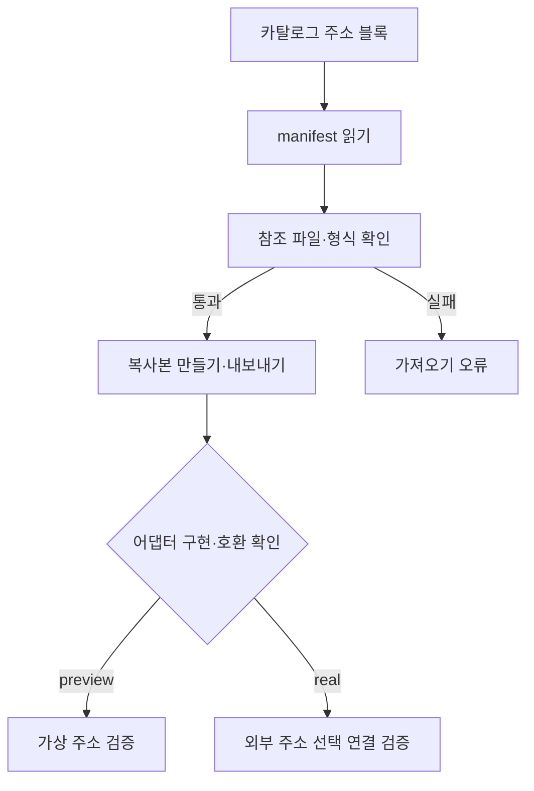

# planning-harness — screen-code-handover 업데이트 인수인계

한국시간 2026년 9월 18~19일 업데이트 보고서. 활동 집계 마감은 9월 19일 21:24:15입니다.

기획 자료와 화면 템플릿을 관리하는 도구입니다. 이번에는 주소 찾기·선택·상세주소 입력을 하나의 재사용 블록으로 묶는 초안이 들어왔습니다.

| 항목 | 기준 |
|---|---|
| 보고서 범위 | 이번 기간의 변경과 관련 기능. 전체 시스템 설명은 아래 기존 상세 문서로 연결합니다. |
| 확인 브랜치 | main |
| 소스 기준 | `31c2c28f5545` |
| 검증 범위 | 현재 커밋의 예제·카탈로그·내보내기·테스트를 정적으로 대조했고 배포 워크플로 success 기록을 확인했습니다. |
| 보고서 세트 | [쉬운 설명](easy-guide.md) · [수정·검증 지시](fix-guide.md) · [코드 인수인계](screen-code-handover.md) |

## 이번 변경의 경계

- 9월 18일 PR #280과 관련 이슈에서 재사용 재료 조사를 진행했습니다.
- 9월 19일 20:44, 주소 블록 manifest·메타데이터·플러그인 계약·카탈로그 등록·테스트를 main에 반영했습니다.
- 해당 커밋의 Deploy Cloudflare Worker 작업은 success입니다. 주소 검색 실서비스까지 완성됐다는 검증은 아닙니다.

이번 업데이트의 핵심은 문서·계약·서버 처리입니다. 실행 화면을 새로 캡처하지 않았으며 확인하지 않은 화면을 실제 실행 결과로 제시하지 않습니다.

## 핵심 파일과 역할

| 핵심 파일 | 함수·컴포넌트 | 담당 역할 |
|---|---|---|
| [app/public/src/template-catalog.js](https://github.com/feed-mina/planning-harness/blob/31c2c28f5545fa9abab225ddb7ae5690875450c9/app/public/src/template-catalog.js) | BUNDLED_TEMPLATE_CATALOG / createCatalogImport | 주소 블록을 카탈로그에 노출하고 가져올 때 복사본 ID·출처를 만듭니다. |
| [app/public/src/export-template.js](https://github.com/feed-mina/planning-harness/blob/31c2c28f5545fa9abab225ddb7ae5690875450c9/app/public/src/export-template.js) | listExampleTemplates / exportExampleTemplate | 예제 ID를 나열하고 선택한 템플릿 파일들을 출력 폴더에 복사합니다. |
| [app/public/examples/address-select-block/metadata/address-select-block.screen.json](https://github.com/feed-mina/planning-harness/blob/31c2c28f5545fa9abab225ddb7ae5690875450c9/app/public/examples/address-select-block/metadata/address-select-block.screen.json) | ADDRESS_BLOCK 초안 | 입력 키와 preview/real 어댑터 규약을 선언합니다. |
| [app/tests/template-catalog-address-block.test.cjs](https://github.com/feed-mina/planning-harness/blob/31c2c28f5545fa9abab225ddb7ae5690875450c9/app/tests/template-catalog-address-block.test.cjs) | 주소 블록 계약 검사 | 참조 파일 존재와 선언·카탈로그 등록을 검사합니다. 실제 외부 주소 검색 검사는 아닙니다. |

## 입력·처리·반환과 부수 효과

| 담당 기능 | 입력 | 처리와 분기 | 반환·출력 | 별도로 일어나는 변경 |
|---|---|---|---|---|
| createCatalogImport | manifest, entry, options | 복제 후 새 ID·provenance 생성 | 가져올 manifest 객체 | 이 함수 자체는 서버 저장 없음 |
| listExampleTemplates | 없음 | 등록한 예제 ID 목록 조회 | 문자열 목록 | 없음 |
| 주소 블록 제안 출력 | 선택한 주소 | zipCode,roadAddress,detailAddress로 정규화 | onChange와 ADDRESS_SELECTED 이벤트 규약 | 실제 런타임 구현은 별도 검증 필요 |

## 동작 흐름

화살표는 호출·데이터 전달 또는 조건 분기를 뜻합니다. 도식에 없는 운영 연결은 확인되지 않았습니다.

## 데이터와 연결 관계

| 저장·전달 대상 | 주요 값 | 관계와 주의점 |
|---|---|---|
| 공통 값 | zipCode,roadAddress,detailAddress | 웹 타깃 변환에서는 snake_case 이름으로 바꿀 수 있습니다. |
| 출처 | sourceProject,sourceTemplateId,sourceVersion,importedAt | 가져온 사본의 출처 정보입니다. |
| DB | 이번 변경에 업무 DB 마이그레이션 없음 | 계약 JSON을 DB 구현으로 표현하지 않습니다. |

## 유지보수와 확인 순서

| 바꾸거나 확인할 것 | 확인 위치와 기준 |
|---|---|
| 카탈로그 등록 | manifestPath와 예제 ID를 함께 확인합니다. |
| 내보내기 | 메타데이터·API 계약·플러그인 파일의 누락을 검사합니다. |
| 실행 호환 | 현재 Studio의 컴포넌트·플러그인 규칙에 맞는지 별도 검증합니다. |

app 폴더에서 `node --test tests/template-catalog-address-block.test.cjs`가 제공됩니다. 이번 보고서는 해당 테스트의 검사 범위를 읽었으며 전체 실행 의존성을 구성하지 않아 재실행하지 않았습니다.

## 검증 결과와 남은 범위

현재 커밋의 예제·카탈로그·내보내기·테스트를 정적으로 대조했고 배포 워크플로 success 기록을 확인했습니다.

주소 검색 모의·실제 어댑터 실행과 웹·모바일 왕복은 미검증입니다. spec.md는 현재 템플릿 상태이므로 실제 완성 요구사항으로 간주하지 않았습니다.

## 기존 상세 문서와 활동 근거

- [주소 블록 조사·설계](https://github.com/feed-mina/planning-harness/blob/31c2c28f5545fa9abab225ddb7ae5690875450c9/docs/sdui-address-select-block.md)
- [PR #280](https://github.com/feed-mina/planning-harness/pull/280)
- [배포 작업 기록](https://github.com/feed-mina/planning-harness/actions/runs/35440953268)

| 한국시간 | 커밋 | 기록된 작업 | 구분 |
|---|---|---|---|
| 09/19 20:44 | [31c2c28](https://github.com/feed-mina/planning-harness/commit/31c2c28f5545fa9abab225ddb7ae5690875450c9) | Investigating reusable code materials in GitHub repositories (#280) | 변경 기록 |
