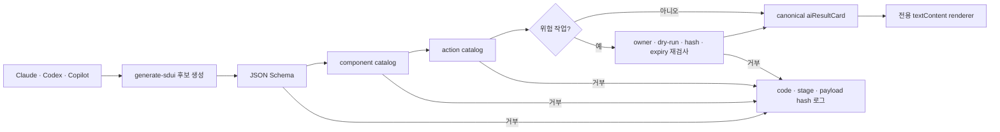

# AI SDUI 안전 파이프라인

AI SDUI는 기존 D1 `ui_metadata` 및 Studio manifest와 분리된 `planning-harness.ai-sdui.v1` 결과 카드 계약이다. Claude, Codex, Copilot 등 제공자 출력은 같은 `aiResultCard`로 정규화되며, 모델 JSON은 기존 `sdui-engine.js`에 직접 전달하지 않는다.



## 계약

- Schema: [`app/contracts/ai-sdui.v1.schema.json`](../app/contracts/ai-sdui.v1.schema.json)
- 서버 검증기: [`app/src/aiSdui.ts`](../app/src/aiSdui.ts)
- 전용 renderer: [`app/public/assets/ai-sdui-runtime.js`](../app/public/assets/ai-sdui-runtime.js)
- Claude 스킬: [`skills/generate-sdui/SKILL.md`](../skills/generate-sdui/SKILL.md)

허용 component와 action의 의미는 [`skills/generate-sdui/references/catalog.md`](../skills/generate-sdui/references/catalog.md)를 따른다. 접두사 정규식으로 새 action을 허용하지 않고 각각을 enum으로 고정한다.

## API

### `POST /api/ai-sdui/validate`

- 로그인 필수
- `application/json`, 최대 64KB
- 순서: structure/Schema → component → action → approval job
- 성공 시 `x-ai-sdui-validated: planning-harness.ai-sdui.v1`과 canonical `result` 반환
- 실패 시 raw 응답을 반환하거나 저장하지 않고 안정적인 `stage`와 `code` 반환

### `POST /api/ai-sdui/approval-jobs/:jobId/approve`

- 로그인 필수
- body는 `operation`, `payload_hash`만 허용
- 서버가 owner, pending 상태, operation, payload hash, dry-run, server-check flag, expiry를 다시 확인
- 조건부 UPDATE로 한 요청만 `pending -> approved` 전이
- 응답은 `execution.started=false`, `endpoint_available=false`; 이 기능에는 위험 작업 실행 API가 없다

승인 job 생성은 trusted/internal producer 전용이다. 공개 create route가 없으므로 AI나 브라우저가 임의 job을 만들 수 없다.

## 브라우저 사용

호스트 페이지는 asset을 명시적으로 로드하고 공개 진입점 하나만 호출한다.

```html
<script src="/assets/ai-sdui-runtime.js"></script>
<script>
  HarnessAiSduiRuntime.validateAndRender(
    document.querySelector("#ai-result"),
    untrustedModelJson,
    {
      onOpenEvidence: ({ refId }) => openEvidenceByStableId(refId)
    }
  );
</script>
```

`validateAndRender`는 먼저 서버에 원문을 보내고 성공 header/body/schema를 모두 확인한다. renderer는 `createElement`와 `textContent`만 사용하며 임의 URL, `innerHTML`, 동적 함수명, 위험 executor를 지원하지 않는다.

## 감사 데이터

Migration `0080_ai_sdui_validation.sql`은 다음만 저장한다.

- 승인 job: user, operation, payload hash, pending/approved/revoked, dry-run flag, expiry
- 검증 event: user, result/schema id, accepted, stage, reason code, payload SHA-256, timestamp

API key, cookie, token, raw prompt, 전체 모델 응답, 실행 target/payload는 저장하지 않는다. 일반 검증 이벤트 INSERT가 실패하면 원 결과를 반환하지 않고 fail-closed `503 audit_unavailable`로 응답한다. 승인 grant 이벤트는 상태 UPDATE와 같은 D1 batch에 묶이므로 INSERT가 실패하면 승인도 롤백되고 안전한 오류로 종료된다.

## 검증

```powershell
Set-Location app
npm.cmd test
npm.cmd run typecheck
npm.cmd run db:migrate:local
node --check public/assets/ai-sdui-runtime.js

Set-Location ..
node skills/generate-sdui/scripts/validate_ai_sdui.mjs skills/generate-sdui/references/example-valid.json
```

필수 거부 케이스는 미등록 component/action, 추가 필드, 과대 payload, direct 위험 action, missing/cross-user/expired/hash mismatch job, 중복 승인, 검증 표식 위조다.
